# E-Commerce Website

## Overview
This is a React-based e-commerce web application that allows users to browse products, manage their cart, and make purchases. The app includes features like user authentication, product filtering, wishlist management, and order tracking.

## Features
- **User Authentication**: Sign up, sign in, and password recovery using Firebase Authentication.
- **Product Browsing**: View product details and search for products.
- **Cart Management**: Add, remove, and update items in the shopping cart.
- **Wishlist**: Save favorite products for later.
- **Order Tracking**: View past orders.
- **Filtering**: Filter products by category and price range.
- **Responsive Design**: Optimized for both desktop and mobile devices.

## Project Structure
.env .gitignore eslint.config.js index.html package.json postcss.config.js public/ src/ App.css App.jsx assets/ components/ common/ pages/ skeletons/ context/ firebase.js index.css main.jsx tailwind.config.js vite.config.js


### Key Files
- **`src/App.jsx`**: Main application component that sets up routing and global state.
- **`src/context/CartContext.jsx`**: Context for managing cart state across the app.
- **`src/components/pages/NotFound.jsx`**: Displays a 404 error page for invalid routes.
- **`src/firebase.js`**: Firebase configuration and initialization.


## Installation
1. Clone the repository:
   ```sh
   git clone https://github.com/sagar-pendam/e-commerce-web-site.git

2. Navigate to the project directory:

```sh
 cd e-commerce 
```

3.Install dependencies:
```sh
npm install
```

4. Create a .env file and add your Firebase configuration.

##
Running the App
The app will be available at https://e-commerce-db-f9711.web.app

##
Deployment
Build the app for production:
```sh
npm run build
```

Serve the production build using a static server or deploy it to a hosting platform like Vercel or Netlify.
##
Dependencies

React: Frontend framework.
React Router: For routing.
Firebase: For authentication and backend services.
Tailwind CSS: For styling.
React Toastify: For notifications.

## Screenshots

### Homepage
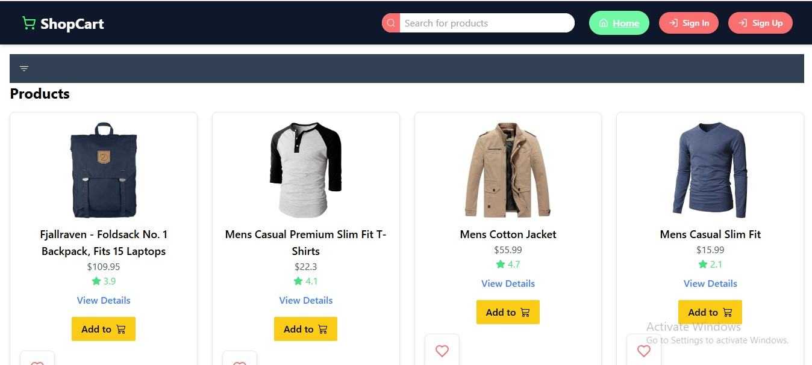

### Product Page
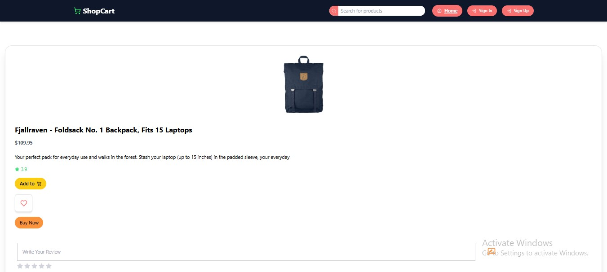

### Cart Page
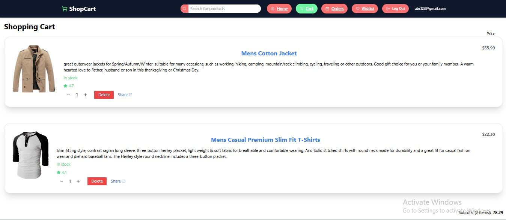

### Wishlist Page
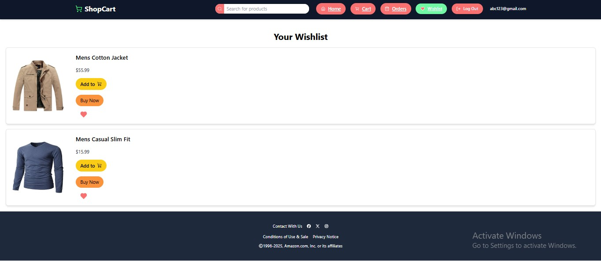

### SignIn Page
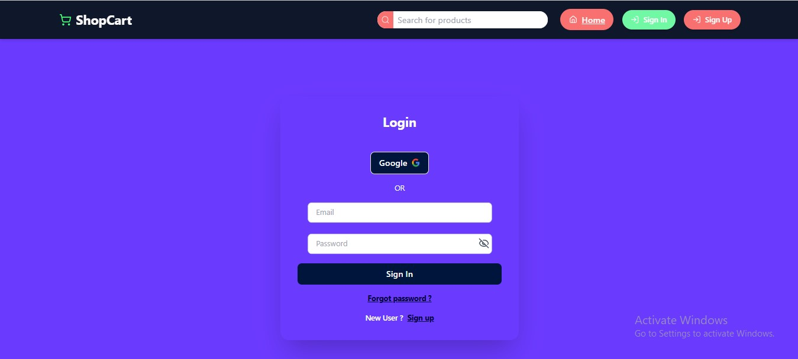

### SignUp Page
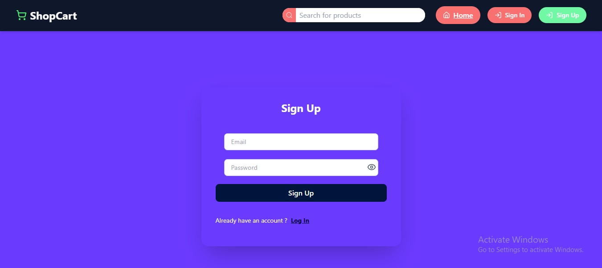

### Responsive Design

#### Tablet View
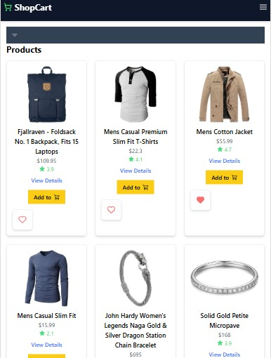

### Product Page
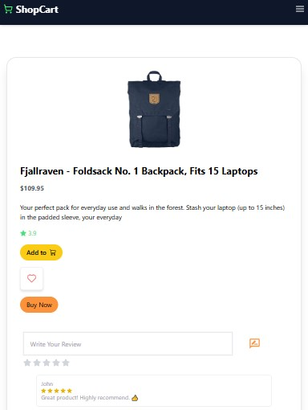

### Cart Page
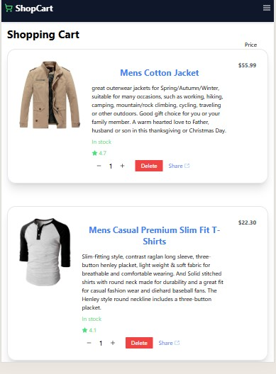


#### Mobile View
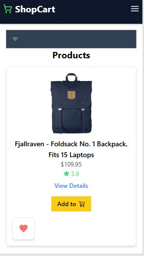

### Product Page
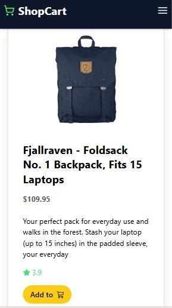

### Cart Page
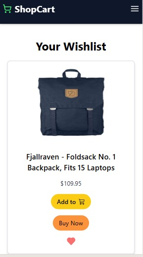